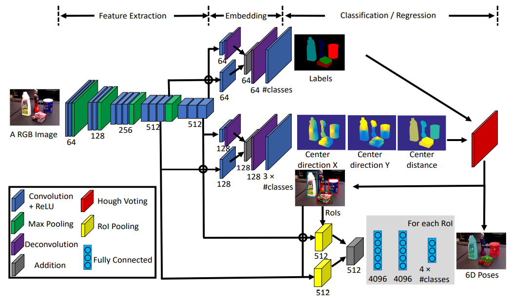
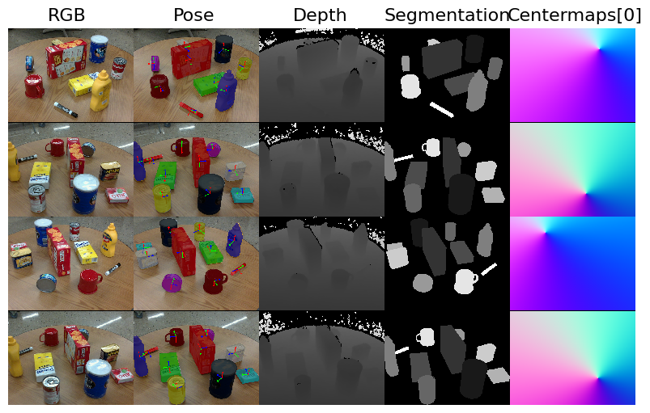
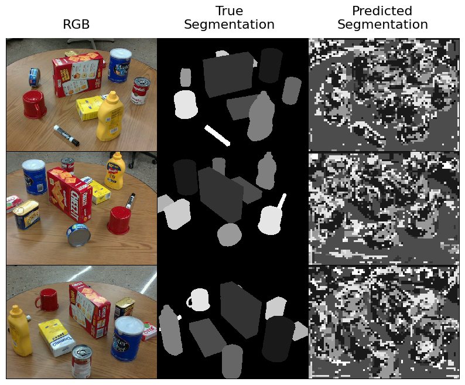

# PoseCNN



A variant of the [PoseCNN](https://arxiv.org/abs/1711.00199) network is implemented in this project. This architecture is designed to take an RGB color image as input and produce a [6 degrees-of-freedom pose](https://en.wikipedia.org/wiki/Six_degrees_of_freedom) estimate for each instance of an object within the scene from which the image was taken. To do this, PoseCNN uses 5 operations within the architecture:

1) Backbone convolutional feature extraction network is used to produce a tensor representing learned features from the input image. 
2) The extracted features are processed by an embedding branch to reduce the spatial resolution and memory overhead for downstream layers. 
3) Instance segmentation branch uses the embedded features to identify regions in the image corresponding to each object instance (regions of interest).
4) Translations for each object instance are estimated using a translation branch along with the embedded features. 
5) Rotation branch uses the embedded features to estimate a rotation, in the form of a [quaternion](https://en.wikipedia.org/wiki/Quaternions_and_spatial_rotation), for each region of interest.


## Getting started

```sh
pip install trimesh
pip install pyrender
pip install pyquaternion
```

## Dataset

In order to train and evaluate object pose estimation models, we need a dataset where each image is annotated with a *set* of *pose labels*, where each pose label gives the 3DoF position and 3DoF orientation of some object in the image.

We used the [PROPS Pose](https://deeprob.org/datasets/props-pose/) dataset, which provides annotations of this form. 
This PROPS Detection dataset is much smaller than typical benchmarking pose estimation datasets, and thus easier to manage.
PROPS comprises annotated bounding boxes for 10 object classes:
`["master_chef_can", "cracker_box", "sugar_box", "tomato_soup_can", "mustard_bottle", "tuna_fish_can", "gelatin_box", "potted_meat_can", "mug", "large_marker"]`.
The choice of these objects is inspired by the [YCB object and Model set](https://ieeexplore.ieee.org/document/7251504) commonly used in robotic perception models.

### Downloading the dataset
A [`PyTorch Dataset`](https://pytorch.org/docs/stable/data.html#torch.utils.data.Dataset) class is created named `PROPSPoseDataset` in `utils/PROPSPoseDataset.py` that will download the PROPS Pose dataset.

Run the following to set a few config parameters and then download the train/val sets for the PROPS Pose dataset.
```py
import multiprocessing

# Set a few constants related to data loading.
NUM_CLASSES = 10
BATCH_SIZE = 4
NUM_WORKERS = multiprocessing.cpu_count()
```

```py
from utils import PROPSPoseDataset
 
train_dataset = PROPSPoseDataset(
    GOOGLE_DRIVE_PATH, "train",
    download=False  # True (for the first time)
) 
val_dataset = PROPSPoseDataset(GOOGLE_DRIVE_PATH, "val")

print(f"Dataset sizes: train ({len(train_dataset)}), val ({len(val_dataset)})")
```

### Visualizing the dataset

Now let's visualize a few samples from the validation set to make sure the images and labels are loaded correctly. Use the `visualize_dataset` function from `rob599/utils.py` to view the RGB observation and labeled pose labels for three random samples. 

```py
from utils import reset_seed, visualize_dataset

reset_seed(0)

grid_vis = visualize_dataset(val_dataset,alpha = 0.25)
plt.axis('off')
plt.imshow(grid_vis)
plt.show()
```

In the below figure, the final column plots the centermaps for class 0, which corresponds to the master chef coffee can. This plot is included to give a sense of how the centermaps represent gradients towards the object's centroid.



## RESULTS

